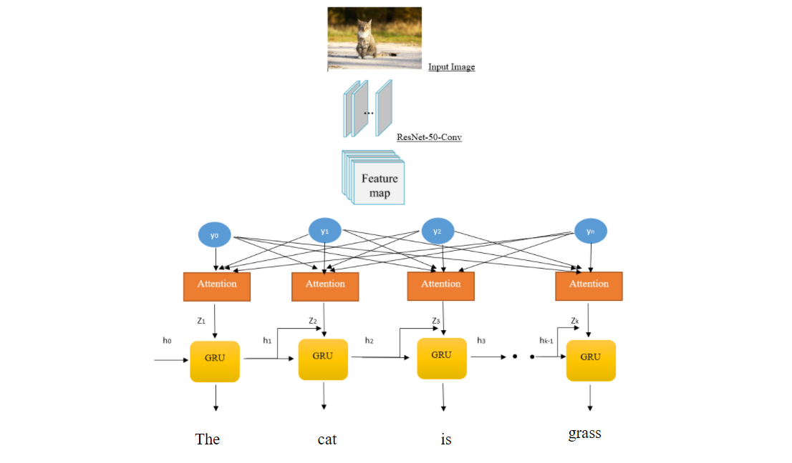

# image_captioning_with_attention
  Image Captioning is the process of generating textual description of an image. The real world application can be to assist the visually impaired. The technology can help the visually impaired people learn about the surrounding without anyone's help.
  
  
  
